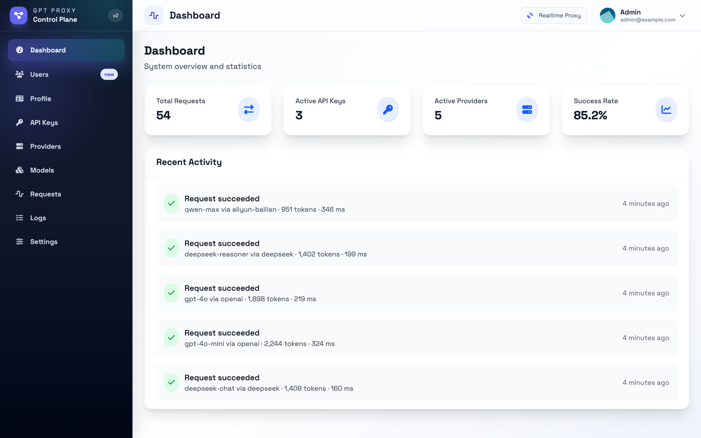
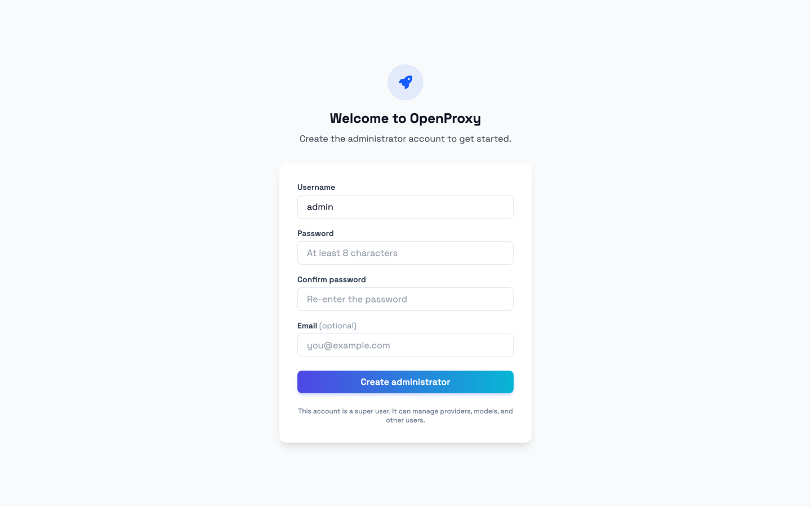
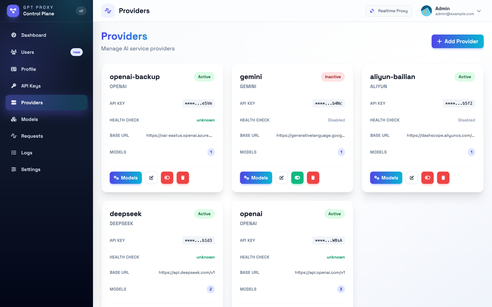
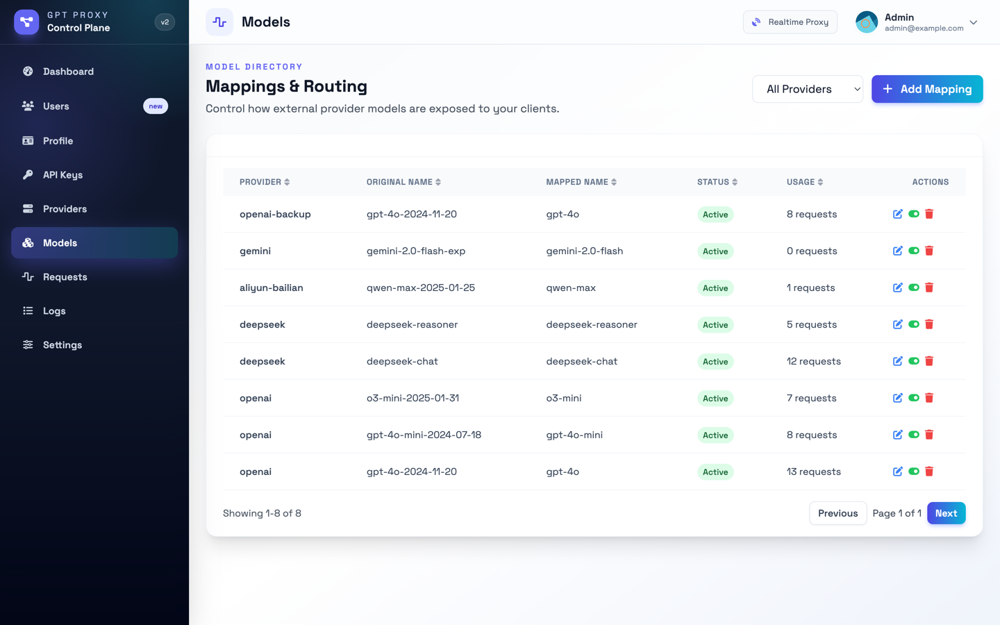
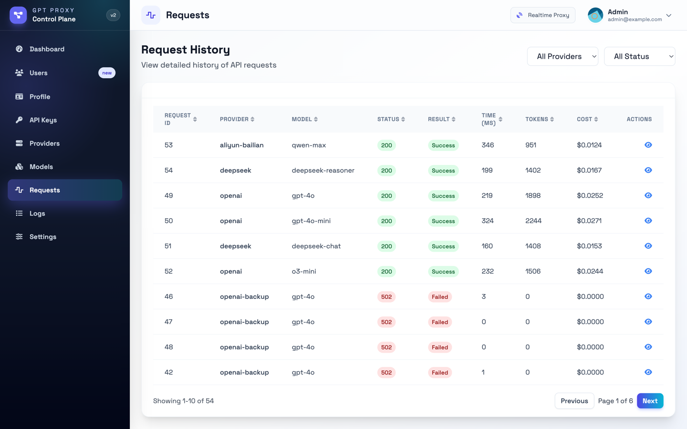
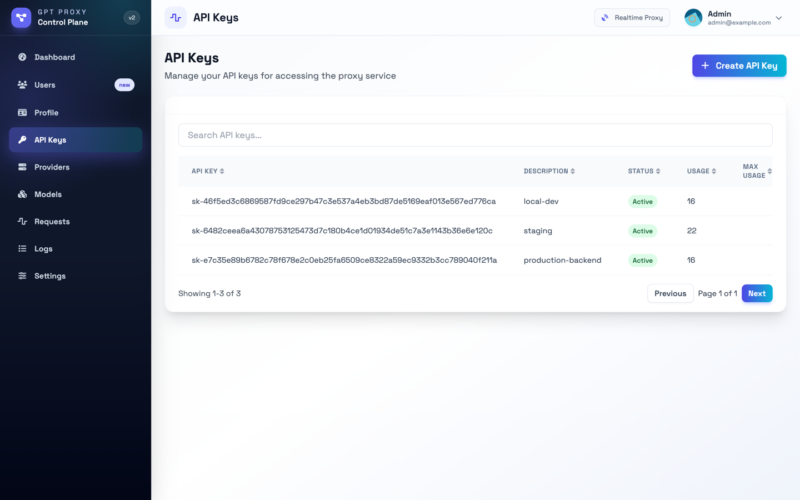

# OpenProxy

A flexible API proxy server for OpenAI-compatible APIs. Written in Go with a Vue.js admin interface.



## Features

- Multiple provider support (OpenAI, Anthropic, Gemini, and custom providers)
- API key management and quota tracking
- Request logging and analytics
- User authentication with JWT
- Admin dashboard for management
- Rate limiting per API key
- Health monitoring for providers

## Quick Start

The binary is self-contained: the admin UI, the SQL migrations, and the static
assets are compiled into it, and it defaults to a SQLite file in the working
directory. No config file, no database server.

```bash
cd src && make all-in-one   # builds the UI, then ../bin/openproxy
../bin/openproxy            # creates ./openproxy.db and listens on :8081
```

Open <http://localhost:8081>. On first start there is no account yet, so the UI
shows a setup page where you create the administrator.

<p align="center">
  
</p>

## Prerequisites

- Go 1.24 or later
- Node.js 18+ (only to build the admin UI)
- PostgreSQL (optional — only if you choose the `postgres` driver)

## Installation

### From Source

```bash
git clone https://github.com/fdddf/openproxy.git
cd openproxy/src
make all-in-one
```

`make build` alone produces a binary without the UI; `make ui` builds the UI
into `src/internal/web/dist`, which `go:embed` picks up.

### Prebuilt binaries

Every tagged release publishes a self-contained binary for linux, macOS, and
Windows on both amd64 and arm64, plus a `checksums.txt`, on the
[releases page](https://github.com/fdddf/openproxy/releases). The admin UI is
compiled in and the SQLite driver is pure Go, so there is nothing else to
install:

```bash
tar -xzf openproxy_v1.0.0_linux_amd64.tar.gz
cd openproxy_v1.0.0_linux_amd64
./openproxy
```

### Using Docker

Images are published to `ghcr.io/fdddf/openproxy` for `linux/amd64` and
`linux/arm64` on every push to `main` and every tag:

```bash
docker run -p 8081:8081 -v openproxy-data:/data ghcr.io/fdddf/openproxy:latest
```

Or build it yourself:

```bash
docker build -t openproxy .
docker run -p 8081:8081 -v openproxy-data:/data openproxy
```

### Using Docker Compose

```bash
cp .env.example .env    # optional — every value has a working default
docker compose up -d
```

That runs one container against SQLite on a named volume. To use Postgres
instead, set `DB_DRIVER=postgres` and `DB_PASSWORD` in `.env`, then:

```bash
docker compose --profile postgres up -d
```

### Using Kubernetes

Manifests live in [`deploy/k8s`](deploy/k8s) — Deployment, Service, PVC, Secret,
and an optional Ingress, with a `kustomization.yaml` tying them together:

```bash
kubectl apply -k deploy/k8s
kubectl port-forward svc/openproxy 8081:8081
```

See [`deploy/k8s/README.md`](deploy/k8s/README.md) for pinning an image tag,
exposing the service, and switching to Postgres to scale past one replica.

## Configuration

### Environment Variables

Environment variables override the config file. Everything has a default;
nothing below is required to start.

| Variable | Description | Default |
|----------|-------------|---------|
| `LISTEN_ADDRESS` | Address to listen on | `:8081` |
| `JWT_SIGN_KEY` | Secret key for JWT signing | generated and persisted on first start |
| `DB_DRIVER` | `sqlite` or `postgres` | `sqlite` |
| `DB_PATH` | SQLite database file | `./openproxy.db` |
| `DB_HOST` | Postgres host | — |
| `DB_PORT` | Postgres port | `5432` |
| `DB_USER` | Postgres user | — |
| `DB_PASSWORD` | Postgres password | — |
| `DB_NAME` | Postgres database name | — |
| `DB_SSL_MODE` | Postgres SSL mode | `disable` |

### Config File

Optional. See `src/config.example.yaml` for every setting; copy it to
`src/config.yaml` to override defaults, or pass `--config /path/to/config.yaml`.

## Database

Migrations are embedded in the binary and applied automatically at startup, for
both drivers. `migrations/sqlite` and `migrations/postgres` hold one set each.

**SQLite (default).** Nothing to set up. The file is created on first start,
with WAL enabled.

**Postgres.** Create the database, then point the config at it:

```yaml
database:
  driver: postgres
  host: localhost
  port: 5432
  user: gptproxy
  password: your_password
  name: gptproxy
```

Existing Postgres installs upgrade in place; their migration history is
unchanged.

## Usage

### Start the Server

```bash
./bin/openproxy
```

### API Endpoints

#### Chat Completions

```bash
curl -X POST http://localhost:8081/v1/chat/completions \
  -H 'Content-Type: application/json' \
  -H 'Authorization: Bearer your-api-key' \
  -d '{
    "model": "gpt-3.5-turbo",
    "messages": [{"role": "user", "content": "Hello!"}],
    "stream": true
  }'
```

#### List Models

```bash
curl http://localhost:8081/v1/models \
  -H 'Authorization: Bearer your-api-key'
```

#### Health Check

Unauthenticated, for container and orchestrator probes:

```bash
curl http://localhost:8081/healthz
# {"status":"ok","version":"..."}
```

### Admin Interface

Access the admin dashboard at `http://localhost:8081`.

There are no default credentials. The first time you open the UI on a fresh
database it redirects to `/setup`, where you create the administrator account.

Accounts are not self-service: only a super user can create further users, and
only super users can manage providers, models, and settings.

## Screenshots

### Providers

Each provider holds its credentials, base URL, and health-check state. Keys are
masked in the API and the UI; editing a provider without touching the field
leaves the stored secret alone.



### Model mappings

Mappings control the name clients ask for and the upstream model it resolves to,
so you can expose `gpt-4o` from whichever provider is currently cheapest.



### Request history

Every proxied call is recorded with status, latency, token counts, and estimated
cost, and the full request and response bodies can be inspected per row.



### API keys

Keys are issued per user and are what clients present to the proxy; the upstream
provider credentials never leave the server.



## Development

### Backend

```bash
cd src
go run .
```

### Frontend

```bash
cd ui
npm install
npm run dev
```

### Build Frontend

```bash
cd ui
npm run build
```

### Request Logging

Proxied requests are recorded for the dashboard. Because that includes prompt and
response bodies, they are truncated (64 KB by default) and pruned after 30 days.
Tune or disable it under `request_log` in the config file.

## Security

- **Environment Variables**: Never commit sensitive data to version control
- **API Keys**: Generate secure, random API keys
- **JWT Secrets**: A key is generated on first start; set `JWT_SIGN_KEY` to pin your own
- **Database**: Use SSL in production environments
- **Exposure**: The proxy has no transport security of its own. Put it behind TLS
  before exposing it beyond localhost.

## License

[MIT](LICENSE)